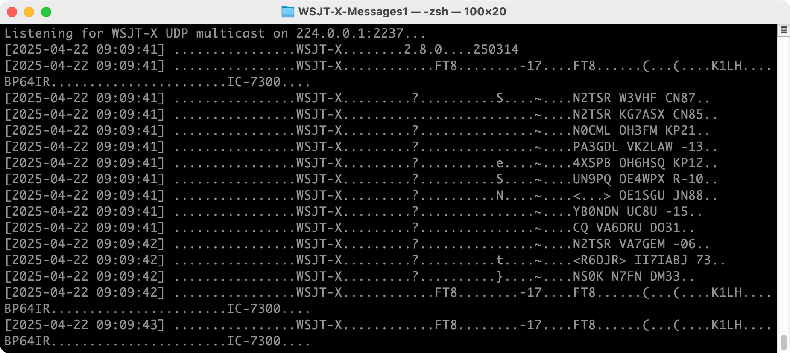

# WSJT-X-Messages
Scripts to display [WSJT-X](https://wsjt.sourceforge.io/wsjtx.html) UDP messages

\
`0-UDP-DATA-TCPD.sh`

Script tcpdump of the udp data on udp port 2237

\
`1-UDP-DATA.py:`

|  |
| - |

\
`2-UDP-MSG-v2.py:`

|  |
| - |

\
`3-UDP-UI-v1.py (Basic message viewer):`

DXCALL [NL8F](https://www.qrz.com/db/NL8F)
|  |
| - |
